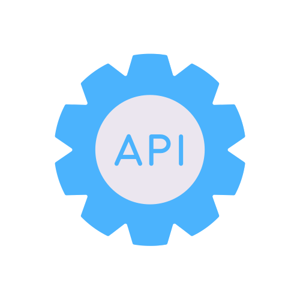

  

###

  <h5> Contact me: </h5>
  
  
  

<h1 align="center">hey there 👋</h1>

###

<h3 align="left">👩‍💻  About Me</h3>

###

I'm ... from ....  - 🔭 I’m working as ... - 📚 I'm currently learning ... - ⚡ In my free time I ...

###

<h3 align="left">🛠 Language and tools</h3>

###

  
  
  
  
  
  
  
  
  
  
  
  
  
  
  
  
  
  
  
  
  
  
  
  
  
  
  

###

<h3 align="left">🔥   My Stats :</h3>

###

  

###
